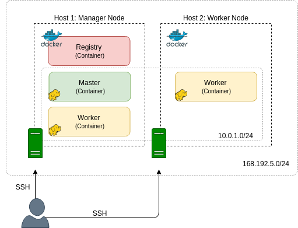
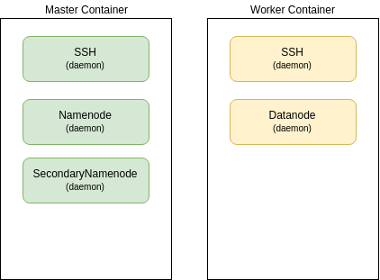
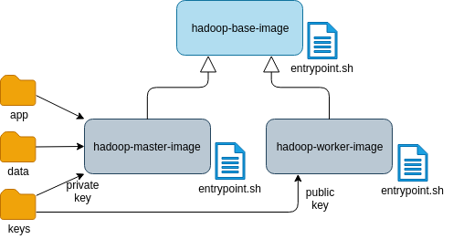

## **<u>Домашнее задание 1.</u>**

### Цель. Создание распределенного вычислительного кластера на базе программных средств Apache Hadoop.

##### Задачи:

1. Создание `Docker`-контейнеров, включающих основные программные компоненты файловой системы Hadoop.`HDFS`.
2. Добавление инструкций и конфигурация (настройка) установленных в контейнеры компонент для 
   выполнения ими соответствующих ролей в распределенном кластере.
3. Конфигурация (настройка) взаимосвязи между узлами (запущенными образами) распределенного кластера.
4. Проверка работоспособности созданного вычислительного кластера.

##### Предлагаемые этапы выполнения задания:

Этап 1. Установка `Docker`. 
Этап 2. Создание базового образа `Hadoop`.
Этап 3. Сборка образов Hadoop Master и Worker 
Этап 4. Развертывание сборки с помощью `Docker Compose`

##### Необходимое программное обеспечение:

- Дистрибутив Docker (официальный сайт: https://www.docker.com/).
- Программные компоненты, необходимые для функционирования узлов кластера, определены в [разделах практики](https://github.com/SergUSProject/BigDataProcSystems_practice).

##### Результат:

​    Функционирующий (т.е. запущены все необходимые службы, выполняются все команды, доступны Web-интерфейсы компонент) распределенный кластер на базе файловой системы `hdfs`.

##### Описание возможного варианта решения:



​                                                                Рисунок 1. Структура (архитектура) кластера




​                                                                         Рисунок 2. Структура контейнера




​                                                                              Рисунок 3. Структура образов


##### Этап 1. Установка `Docker` ([инструкция по установке](https://docs.docker.com/engine/install/ubuntu/)).

##### Этап 2. Сборка `Docker`-файла на Ubuntu.

​	Необходимо взять базовый образ `ubuntu` и добавить инструкции так же, как это было сделано на виртуальной машине.
​	В `Dockerfile` необходимо:

 - установить `OpenSHH` и `Java 8`
 - создать пользователя без root-привилегий
 - загрузить архив дистрибутива `Hadoop` и распаковать его
 - скопировать/создать подготовленные файлы конфигурации `Hadoop`
 - скопировать скрипт `entrypoint.sh` 
 - применить сценарий `entrypoint.sh`

шаблон `Docker`-файла можно найти здесь (ссылка)

Сценарий [`entrypoint.sh`](./base/entrypoint.sh) который содержит скрипт запуска службы `SSH` и демонов `Namemode` и `Datanode`
запуск компиляции образа производится командой `docker build`

##### Этап 3. 

##### 	Сборка `Master Image`. 

 Вариант [`Docker`-файла](./master/Dockerfile) 
 Пример сценария [`entrypoint.sh`](./master/entrypoint.sh) 

 Компиляции образа производится командой `docker build`

#####  	Сборка `Worker Image`. 

 Вариант [`Docker`-файла](./worker/Dockerfile)
 Пример сценария [`entrypoint.sh`](./worker/entrypoint.sh) 

 Компиляции образа производится командой `docker build`

##### Этап 4. Создать файл `docker-compose.yml` ([например](https://raw.githubusercontent.com/SergUSProject/BigDataProc_HomeWorks/main/HomeWork_1/docker-compose.yml))

В файле `docker-compose.yml` в разделе `volumes` необходимо прописать разделы хостовой операционной системы, в которых будут размещены исполняемые файлы программ и файлы с данными для обработки, например:

```
volumes:
  - ./app:/home/bigdata/app     # .jar, .py files
  - ./data:/home/bigdata/data   # data to copy to HDFS
```

Эти разделы понадобятся при выполнении **Домашнего задания 2**

Получить содержимое папки /home/bigdata/app можно путем создания [`jar`-файла java-проекта](./projects/java/mapreduce_java.md) или [`jar`-файла scala-проекта](./projects/scala/mapreduce_scala.md), а также путем копирования [`.py` файлов](./projects/python/mapreduce_python.md).

В папку /home/bigdata/data необходимо скопировать файл [review товаров](https://disk.yandex.ru/d/KHXsSY4tN01Onw) и скопировать и распаковать файл [рейтинга товаров](https://disk.yandex.ru/d/an4fqzhLc_FUGw).

Развернуть кластер `Hadoop`. Выполните следующую команду, чтобы развернуть `Master` и 4 `Workers`:

```
docker-compose up -d --scale worker=4
```
