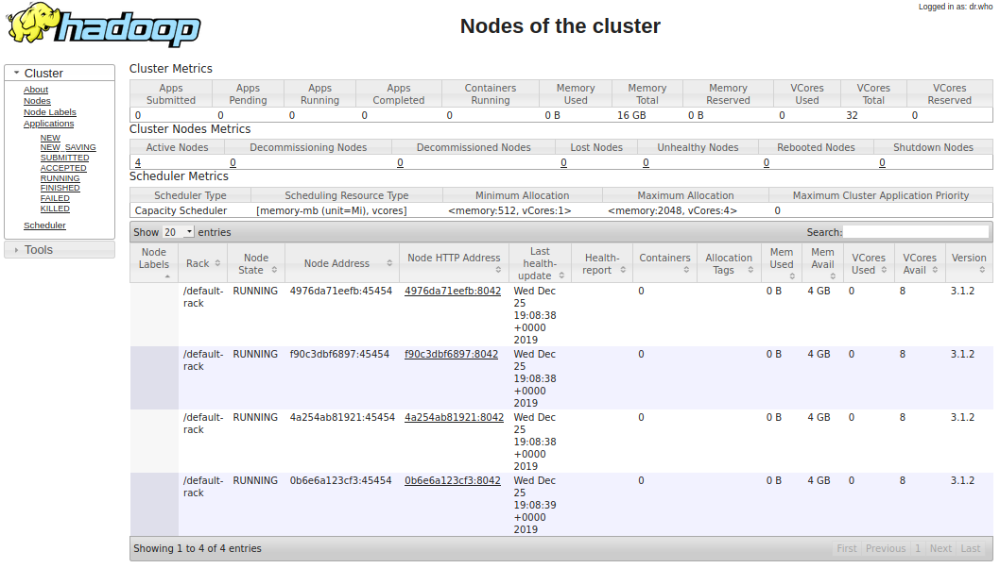
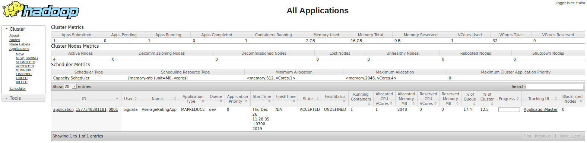
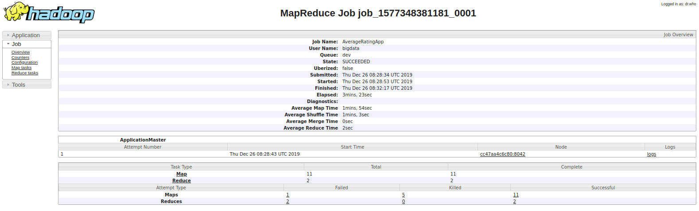

## **<u>Домашнее задание 2.</u>**

### Цель. Развертывание вычислительного кластера Apache Hadoop и выполнение MapReduce-приложения на менеджере ресурсов YARN.

##### Задачи:

1. Развертывание вычислительного кластера Apache Hadoop на базе `Docker`-контейнеров, включающих основные программные компоненты файловой системы Hadoop.
2. Проверка работоспособности развернутого кластера и состояния его компонентов.
3. Запуск и выполнение MapReduce-приложения на менеджере ресурсов развернутого кластера YARN.

#### 1. Развертывание вычислительного кластера  Apache Hadoop.

Выполнение [Домашнего задания 1](../HomeWork_1/) завершилось выполнением следующей команды по развертыванию master-node и 4 worker-nodes:

`docker-compose up -d --scale worker=4`

При успешном запуске в терминале должно появиться следующий вывод:

```
Creating network "hadoop_default" with the default driver
Creating master          ... done
Creating hadoop_worker_1 ... done
Creating hadoop_worker_2 ... done
Creating hadoop_worker_3 ... done
Creating hadoop_worker_4 ... done
```

#### 2. Проверка работоспособности развернутого кластера и состояния его компонентов.

###### Обращение к соответствующим log-записям компонентов кластера должно завершится следующим:

`docker container logs master`

```
Start SSH service
 * Starting OpenBSD Secure Shell server sshd
   ...done.
Start Hadoop daemons
Copy files to HDFS
The entrypoint script is completed
```

`docker container logs hadoop_worker_1`

```
Start SSH service
Starting OpenBSD Secure Shell server: sshd.
Start Hadoop daemons
WARNING: /home/bigdata/hadoop/logs does not exist. Creating.
```

###### Проверка Hadoop daemons:

Просмотр запущенных datanodes в `HDFS`: 

`docker exec master bash hdfs dfsadmin -printTopology`

```
Rack: /default-rack
   172.20.0.3:9866 (hadoop_worker_4.hadoop_hd-network)
   172.20.0.4:9866 (hadoop_worker_3.hadoop_hd-network)
   172.20.0.5:9866 (hadoop_worker_2.hadoop_hd-network)
   172.20.0.6:9866 (hadoop_worker_1.hadoop_hd-network)
```

Просмотр `data` директории:

`docker exec master bash hdfs dfs -ls /data`

Вы должны увидеть содержимое папки в терминале (например):

```
Found 1 items
-rw-r--r--   3 bigdata supergroup      69053 2019-12-25 19:04 /data/samples.json
```

Запустите Ваш Web-браузер и перейдите по адресу: `localhost:9870` для просмотра HDFS Web UI.

<center>


<i>Figure 1. Таблица Datanodes </i></center>

Теперь просмотрим все Nodemanagers на менеджере ресурсов `YARN`:

`docker exec master bash yarn node --list`

Перейдем по адресу `localhost:8088` , чтобы открыть YARN Web UI.

<center>



<i>Figure 2. YARN: Nodes</i></center>


## Запуск MapReduce-приложения

**Задание.** Выполните на выбор скрипт по запуску MapReduce-приложения (`.jar` java, `.py` или `.jar` scala), размещенного в `./app` , для данных из `./data` и запишите результат в `./data/output/` и в `hdfs`


```
docker exec master bash \
    Ваш код
```

Проверьте список приложений, выполняемых на YARN-кластере:

`docker exec master bash yarn app -list`

Проверьте список приложений, выполняемых на YARN-кластере:

`docker exec master bash yarn app -status appId`

Аналогичные действия Вы можете выполнить при помощи YARN Web UI.

<center>



<i>Figure 3. Applications</i></center>


<center>


<i>Figure 4. YARN queues</i></center>


<center>



<i>Figure 5. MapReduce Job</i></center>

**Результат выполнения** <u>**Домашней работы № 2**</u>

Выполните команду в master-node кластера по просмотру содержимого `hdfs`  содержимого каждого файла результата. Результат представьте в виде кода команд и снимков экрана с результатом выполнения команд в терминале и с помощью Hadoop Web UI.


После выполнения остановите контейнеры:

`docker-compose stop`

```
Stopping hadoop_worker_2 ... done
Stopping hadoop_worker_4 ... done
Stopping hadoop_worker_1 ... done
Stopping hadoop_worker_3 ... done
Stopping master          ... done
```

Остановите (если запущены) и удалите Ваши контейнеры и сеть

`docker-compose down`

```
Stopping hadoop_worker_1 ... done
Stopping hadoop_worker_4 ... done
Stopping hadoop_worker_3 ... done
Stopping hadoop_worker_2 ... done
Stopping master          ... done
Removing hadoop_worker_1 ... done
Removing hadoop_worker_4 ... done
Removing hadoop_worker_3 ... done
Removing hadoop_worker_2 ... done
Removing master          ... done
Removing network hadoop_default
```

При удалении контейнеров все данные в HDFS будут потеряны.
