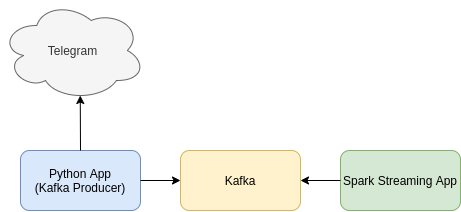

# ДОМАШНЕЕ ЗАДАНИЕ 3. Обработка потоков данных посредством Spark Streaming


### Содержание

- [Задание 1. Подсчет количества сообщений в телеграм-канале](#Задание-1-Подсчет-количества-сообщений-в-телеграм-канале)
- [Задание 2. Подсчет количества собственных имен существительных](#Задание-2.-Подсчет-количества-собственных-имен-существительных)
- [Задание 3. Подсчет количества собственных имен существительных по каналам](#Задание-3.-Подсчет-количества-собственных-имен-существительных-по-каналам)

## Общие сведения

Создание `telegram`-приложения:
- [Creating your Telegram Application](https://core.telegram.org/api/obtaining_api_id)


Библиотека `telethon`:
- [github](https://github.com/LonamiWebs/Telethon)
- [документация](https://docs.telethon.dev/en/stable/)

Создание `telegram`-клиента

```python
api_id = YOUR_API_ID 
api_hash = YOUR_API_HASH

client = TelegramClient('session', api_id, api_hash)
```

⚠️ **Замечания** 
1. В качестве брокера сообщений использовать Kafka
2. Для работы с потоком `telegram` сообщений - пакет `telethon==1.24.0`
3. Для передачи данных в `Kafka` - пакет `kafka-python==2.0.2`
4. Значения `YOUR_API_ID` и `YOUR_API_HASH` будут доступны после создания `telegram`-приложения
5. Для подключения к каналам используйте экземпляр класса `JoinChannelRequest`, для получения сообщений каналов - `events.NewMessage`, для получения наименований каналов - метод `client.get_entity`, для отключения от канала - `LeaveChannelRequest` (если необходимо)
6. Сообщения будут доступны только после подключения к каналу

Пример запуска `async` функции

```python
async main():
    ...


with client:
    client.loop.run_until_complete(main())
```

Для прослушивания новых сообщений
```python
client.run_until_disconnected()
```

Архитектура:



## Задание 1. Подсчет количества сообщений в телеграм-канале

Напишите программу, которая подсчитывает количество сообщений каждого пользователя в течение 1 мин. и в течение 10 мин. каждые 30 сек (window). Выведите результат в отсортированном по убыванию количества

Формат вывода: `username`, количество

Телеграм-каналы (id):

1050820672, 1149896996, 1101170442, 1036362176, 1310155678, 1001872252, 1054549314, 1073571855

⚠️ **Замечание.** Добавьте код для подключения к телеграм-каналам посредством `telethon`


## Задание 2. Подсчет количества собственных имен существительных

Напишите программу, которая подсчитывает количество собственных имен существительных в сообщениях телеграм-каналов (см. задание 1) в течение 1 мин. с накоплением. Каждую 1 мин. сохранять результат в файл в отсортированном по убыванию количества виде. Накапливать не менее 30 мин. При завершении программы вывести в консоль 10 наиболее популярных слов

Формат вывода: слово, количество

⚠️ **Замечания** 
- Под собственными именами существительных в данном случае предполагаем те слова, которые состоят из букв русского алфавита и начинаются с заглавной буквы. 
- Можно не учитывать первое слово в предложении и/или добавить проверку на стоп-слова ([ссылка](https://github.com/stopwords-iso/stopwords-ru/blob/master/raw/stop-words-russian.txt))
- При этом удаляйте гласные буквы и "й" в конце слова.


## Задание 3. Подсчет количества собственных имен существительных по каналам

```
TODO
```